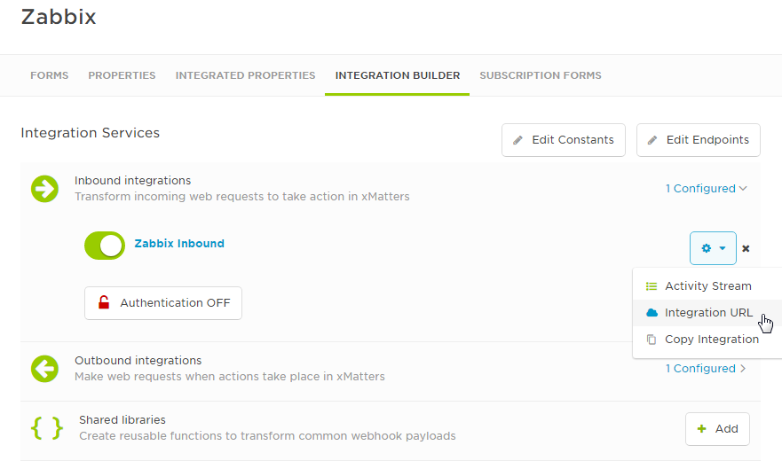
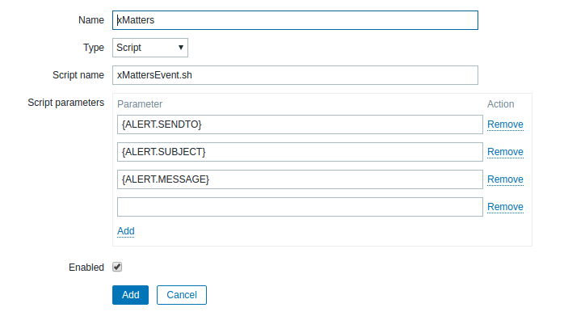
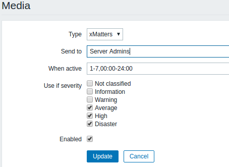
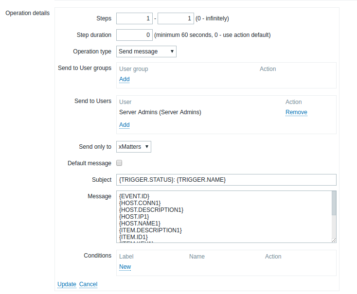

# Zabbix
[Zabbix](https://www.zabbix.com) is a mature and effortless enterprise-class open source monitoring solution for network monitoring and application monitoring of millions of metrics. This integration extends the alerting capabilities to use xMatters. 

# Pre-Requisites
* [Zabbix](https://www.Zabbix.com) (tested with version 3.2 but should support others)
* xMatters account - If you don't have one, [get one](https://www.xmatters.com)!
* xMatters Integration Agent (IA) - Installed on the Zabbix server and configured. The IA is available [here](https://support.xmatters.com/hc/en-us/articles/201463419-Integration-Agent-for-xMatters-5-x-xMatters-On-Demand).

# Files
* [zabbix_comm_plan.zip](zabbix_comm_plan.zip) - The Communication Plan that receives Zabbix alerts
* [zabbix_files.zip](zabbix_files.zip) - Files required by the Integration Agent and Zabbix

# Installation

## xMatters set up
### Add Event Domain
To add the Event Domain in xMatters:
1. In xMatters, go to the ****Developer** tab and then select **Event Domains** from the left hand menu.
2. Click on the **applications** link.
3. Click **Add New** next to INTEGRATION SERVICES.
4. Enter `Zabbix` as the name and click **Save**.

### Import the communication plan
To import the communication plan into xMatters:
1. In xMatters, go to the **Developer** tab and click **Import Plan**.
2. Click **Choose File**, and then locate the downloaded communication plan (.zip file).
3. Click **Import Plan**.
	* Importing the plan will automatically enable it, and enable its forms for web services.

### Access URL
The Comm Plan has a URL that is required when configuring the Integration Agent.
To get the URL:
1. On the Zabbix Comm Plan, click **Edit**, then **Integration Builder**.
2. On the Integration Builder tab, expand the list of Inbound integrations.
3. Click the gear icon beside Zabbix inbound, and then select **Integration URL**.

<kbd>
	
</kbd>

Copy the URL displayed in the dialog box and save it for use below.

## Setup the Integration Agent (IA) 
To add the Zabbix integration to your Integration Agent:
1. Extract zabbix_files.zip on the Zabbix server.
2. Under the integration-agent folder, copy the zabbix folder to &lt;IA_HOME&gt;/integrationservices/
3. Edit &lt;IA_HOME&gt;/integrationservices/zabbix/configuration.json
	* Set WEB_SERVICE_URL to the URL copied earlier.
	* Set ZABBIX_API_URL with the correct URL to your Zabbix API.
4. Edit &lt;IA_HOME&gt;/conf/IAConfig.xml
    * Add `<path>integrationservices/zabbix/zabbix.xml</path>` under the &lt;service-configs&gt; node.

## Zabbix Setup
### Add xMatters API User
In order for xMatters to Acknowledge and add comments to a Zabbix event, it needs to be able to use the Zabbix API. In order to use the API, an xMatters user needs to be created in Zabbix for authentication:
1. In Zabbix, go to **Administration**, then **Users** and click **Create User**.
2. On the **User** tab, enter the following:
    * **Alias**: `xMatters`
    * **Name**: `xMatters`
    * **Surname**: `API`
    * **Groups**: &lt;select any group available in your instance of Zabbix&gt;
    * **Password**: &lt;set a password for this user&gt;
    * **Password (once again)**: &lt;repeat the previous password&gt;
        * Remember this password as it will be needed later
3. On the **Permissions** tab, enter the following:
    * **User Type**: Zabbix Super Admin
4. Click **Add**.

### Create the xMatters Media Type
Media types are used for sending notifications from Zabbix. To create an xMatters Media Type:
1. In Zabbix, go to **Administration**, then **Media Types** and click **Create Media Type**.
2. Enter the following:
    * **Name**: `xMatters`
    * **Type** Script
    * **Script Name**: `xMattersEvent.sh`
    * **Script Parmeters**:
        * `{ALERT.SENDTO}`
        * `{ALERT.SUBJECT}`
        * `{ALERT.MESSAGE}`
3. Click **Add**.

<kbd>
	
</kbd>

### Create/Update Recipients
If you intend to send notifications directly to specific users:
1. In Zabbix, go to **Administration**, then **Users** and select your user.
2. In the **Media** tab, click the **Add** link.
3. Enter the following:
    * **Type**: xMatters
    * **Send to**: &lt;the user's xMatters User ID&gt;
    * **When active**: `1-7,00:00-24:00`
    * **Use if severity**: &lt;select the severity levels you want to notify on&gt;
4. Click **Add**.
5. Repeat these steps for each of your users. 

<kbd>
	
</kbd>

If you intend to send notifications to groups in xMatters, you will need to create a **user** (not a group) in Zabbix to represent the xMatters group. You cannot use Zabbix groups as Zabbix expands those groups before calling xMatters, sending it to each user individually instead of following group shifts and escalations.

To send to notifications to xMatters groups:
1. In Zabbix, go to **Administration**, then **Users** and click **Create User**.
2. On the **User** tab, enter the following:
    * **Alias**: &lt;the name of your xMatters group&gt;
    * **Groups**: &lt;either select a group that has access to all hosts that you'll want this xMatters group to get notifications on OR select any group and set the User Type to Zabbix Super Admin (see below)&gt;
    * **Password**: &lt;set a password for this user&gt;
    * **Password (once again)**: &lt;repeat the previous password&gt;
3. In the **Media** tab, click the **Add** link.
4. Enter the following:
    * **Type**: xMatters
    * **Send to**: &lt;the user's xMatters User ID&gt;
    * **When active**: `1-7,00:00-24:00`
    * **Use if severity**: &lt;select the severity levels you want to notify on&gt;
5. Click **Add**.
6. On the **Permissions** tab, enter the following:
    * User Type: &lt;depending on the Groups setting in step 2, set this to Zabbix User or Zabbix Super Admin)
7. Click **Add**.
8. Repeat these steps for each of your xMatters groups.

### Create Actions
In Zabbix, an Action is used to when you want to do something (such as send a notification) based on an event.
To create an Action that sends a notification via xMatters:
1. In Zabbix, go to **Configuration**, then **Actions** and click **Create Action**.
2. In the **Action** tab, set a Name and Conditions for your Action.
3. In the **Operations** tab, under the Operations section click the **New** link.
4. Enter the following:
    * **Send to Groups**: &lt;leave empty&gt;
    * **Send to Users**: &lt;select your users and/or xMatters groups&gt;
    * **Send only to**: xMatters
    * **Default message**: &lt;uncheck&gt;
    * **Message**: &lt;enter the following in order, one per line&gt;
``{EVENT.ID} {HOST.CONN1} {HOST.DESCRIPTION1} {HOST.IP1} {HOST.NAME1} {ITEM.DESCRIPTION1} {ITEM.ID1} {ITEM.KEY1} {ITEM.NAME1} {ITEM.VALUE1} {TRIGGER.NAME} {TRIGGER.SEVERITY} {TRIGGER.STATUS} {TRIGGER.URL}``
5. Click the **Add** link (not the button).
6. Click the **Add** button.

<kbd>
	
</kbd>

## Setup Alert Script 
To add the Zabbix integration to your Integration Agent:
1. Extract zabbix_files.zip on the Zabbix server.
2. Under the zabbix-alertscripts folder, copy xMattersEvent.sh to the Zabbix AlertScripts folder.
    * If you don't know the location of the Zabbix AlertScripts folder, check your Zabbix configuration file.
3. In the Zabbix AlertScripts folder, execute ``chmod 755 xMattersEvent.sh``

## Setup Encrypted Password File
In the Add xMatters API User step above, you created a user called xMatters in Zabbix. The Integration Agent will log in as this user when accessing the Zabbix API. To encrypt the password for xMatters to use when it logs in, perform the following:
1. Change directory to &lt;IA_HOME&gt;/bin
2. Execute ``./iapassword.sh --new <PASSWORD> --file integrationservices/zabbix/.zabbixpasswd``
    * Replace &lt;PASSWORD&gt; with the password for the xMatters user in Zabbix.
    * Note that there are two dashes in front of ``new`` and ``file``.

# Testing
To test the integration, create a Zabbix event by causing the conditions required to trigger it. The associated Action will call xMatters to send notifications.

When you receive the xMatters notification, respond with **Acknowledge** and, if using the xMatters Mobile App, add a comment. In Zabbix, go to **Monitoring**, then **Problems** to verify that the event is acknowledged and that any comment is shown when you mouse over the Ack.

